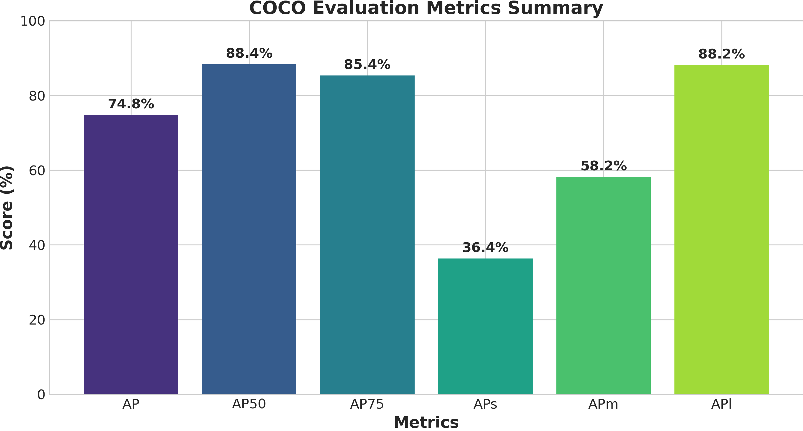
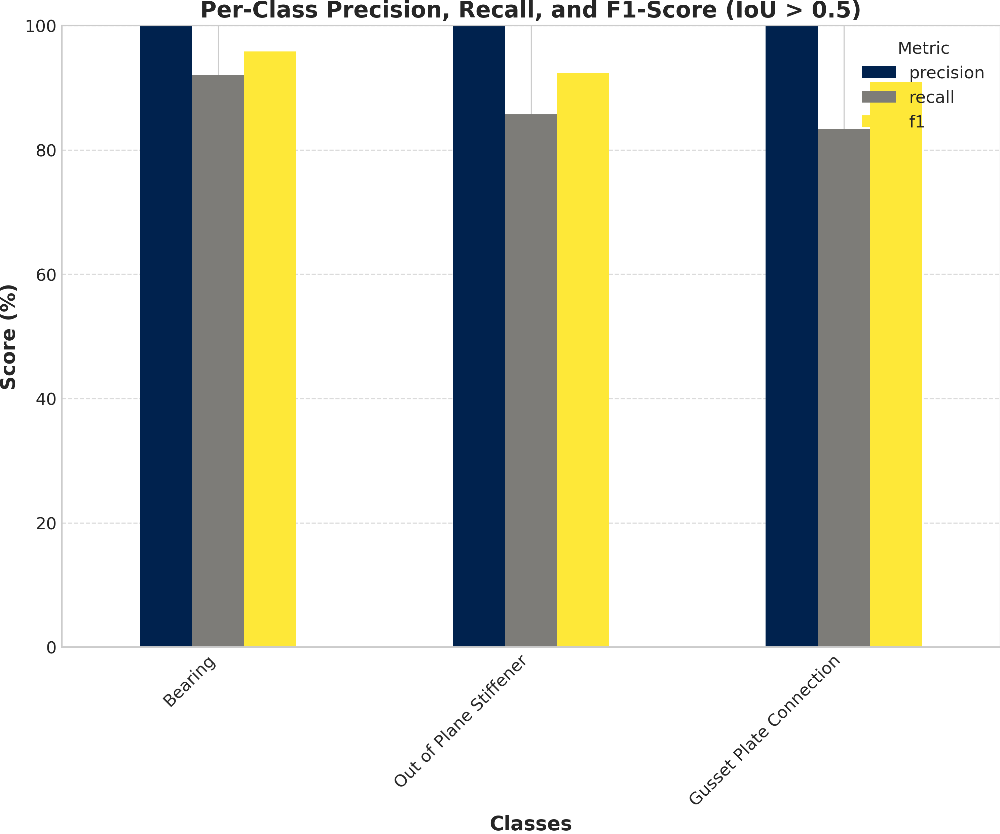
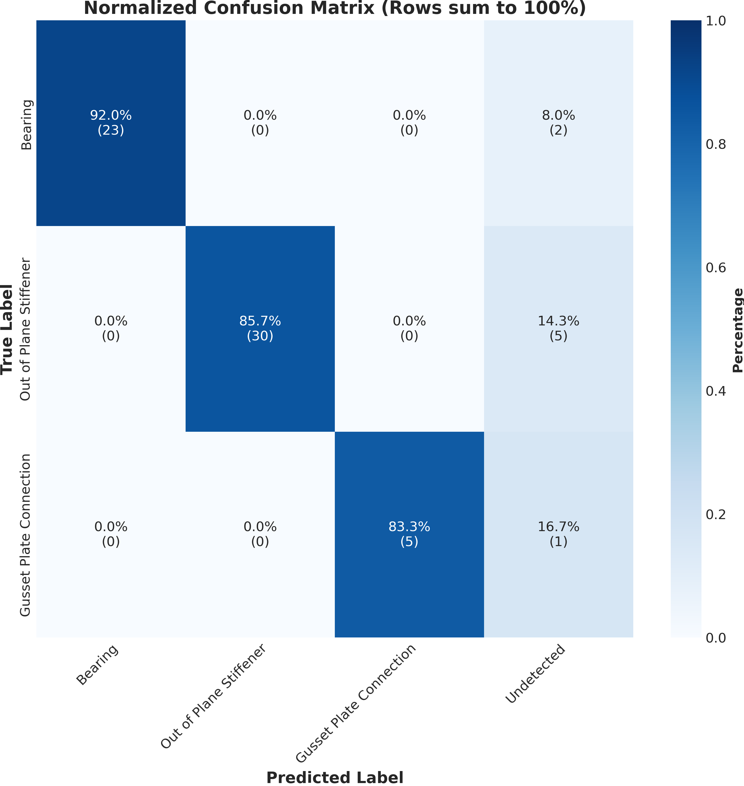
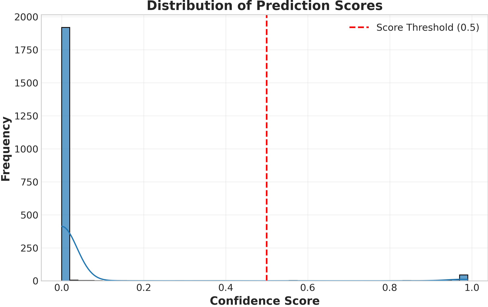
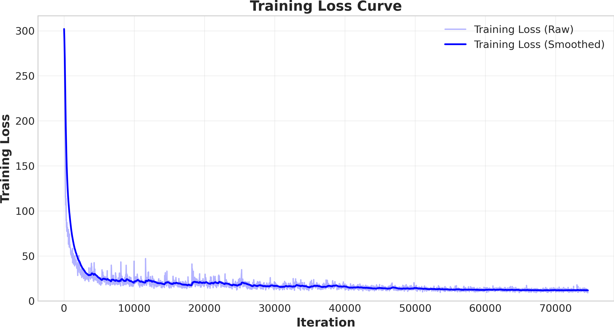
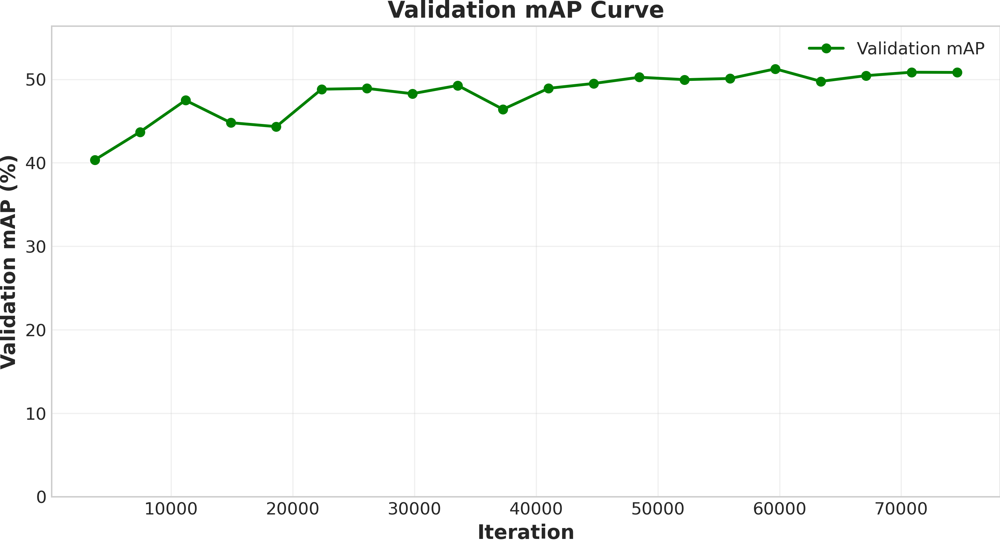
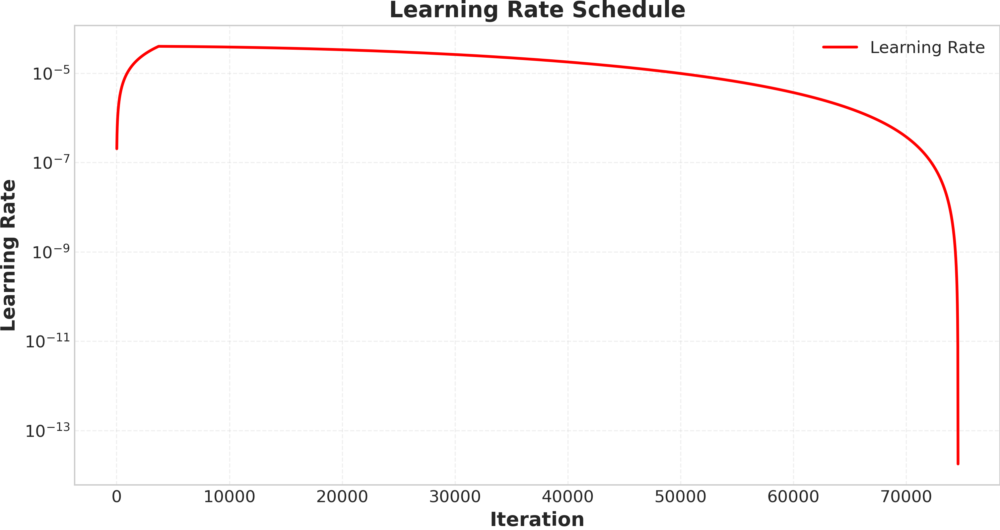

# Mask2Former Evaluation Report

**Dataset:** instance_test
**Number of validation images:** 20
**Classes:** Bearing, Out of Plane Stiffener, Gusset Plate Connection

## 📊 COCO Evaluation Metrics

### Detailed COCO Metrics

| Metric | Value |
|--------|-------|
| AP | 74.782 |
| AP-Bearing | 76.075 |
| AP-Gusset Plate Connection | 73.366 |
| AP-Out of Plane Stiffener | 74.906 |
| AP50 | 88.375 |
| AP75 | 85.354 |
| APl | 88.153 |
| APm | 58.164 |
| APs | 36.367 |

## 📈 Class-Specific Performance

### Performance Metrics (IoU > 0.5, Score > 0.5)

| Class | Precision | Recall | F1-Score | TP | FP | FN |
|-------|-----------|--------|----------|----|----|----|
| Bearing | 1.000 | 0.920 | 0.958 | 23 | 0 | 2 |
| Out of Plane Stiffener | 1.000 | 0.857 | 0.923 | 30 | 0 | 5 |
| Gusset Plate Connection | 1.000 | 0.833 | 0.909 | 5 | 0 | 1 |

## 🎯 Analysis

## 📉 Training Progress

## 🔍 Key Findings

- **Best performing class:** Bearing (F1: 0.958)
- **Worst performing class:** Gusset Plate Connection (F1: 0.909)
- **Overall macro-averaged precision:** 1.000
- **Overall macro-averaged recall:** 0.870
- **Overall macro-averaged F1:** 0.930
