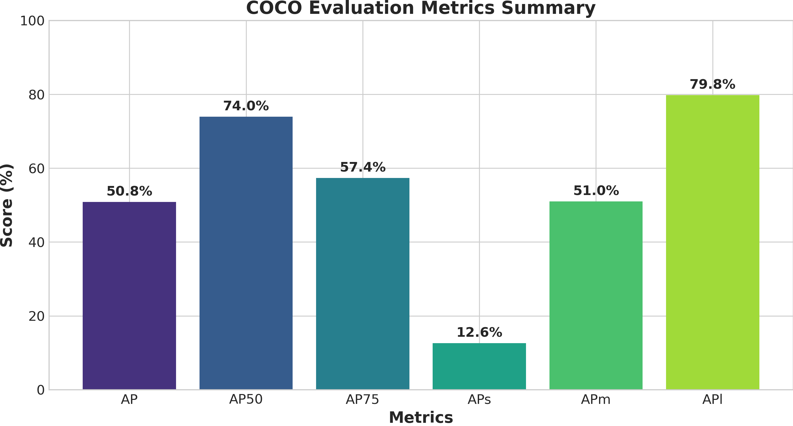
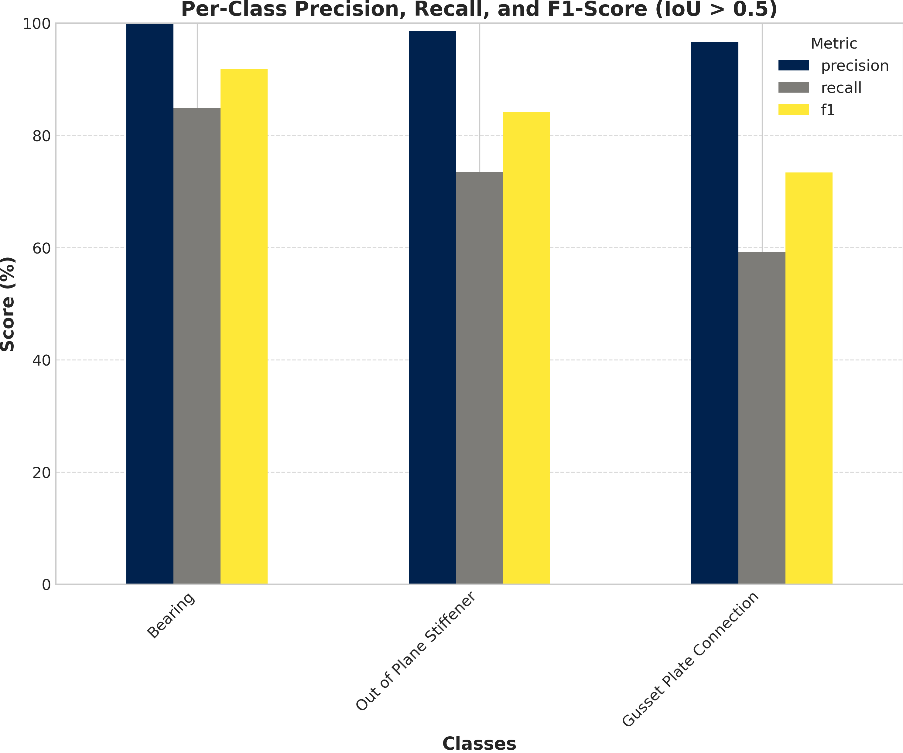
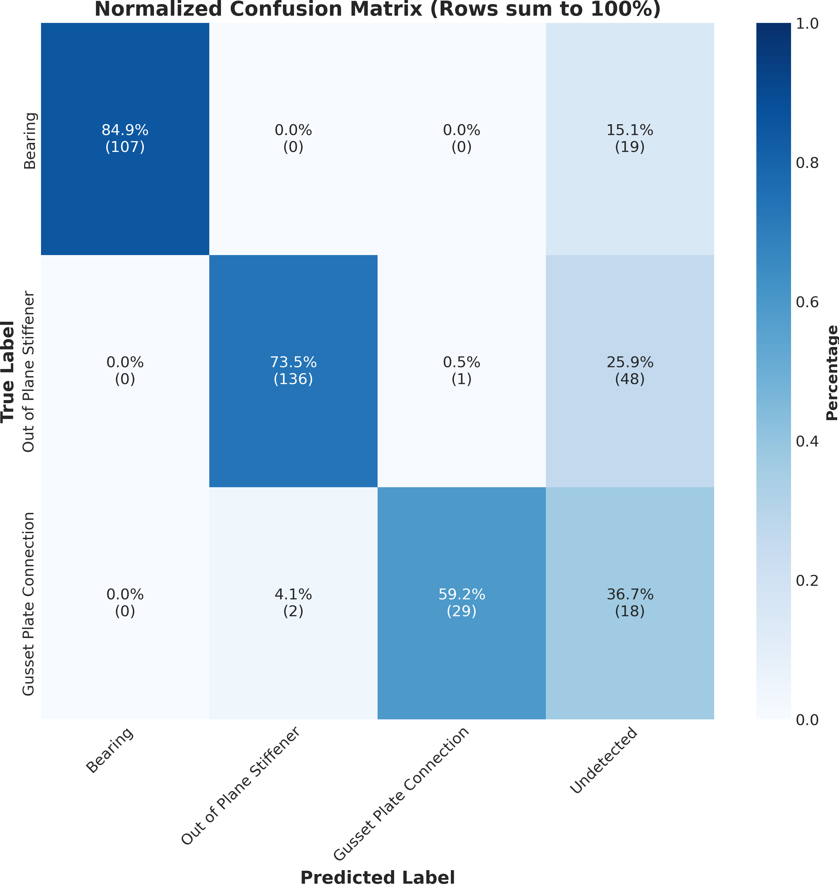
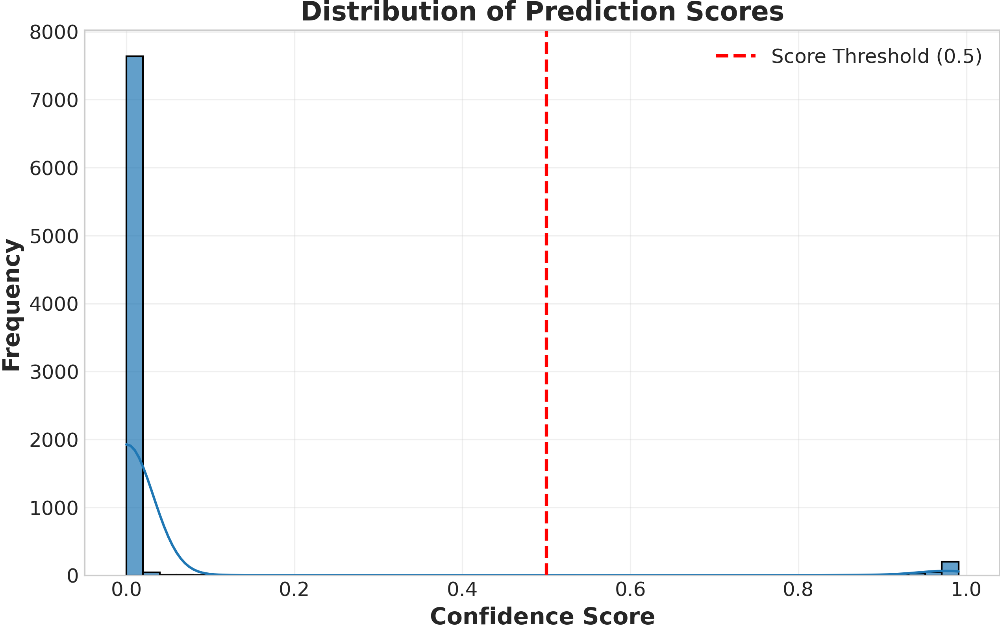

# Mask2Former Evaluation Report

**Dataset:** instance_val
**Number of validation images:** 81
**Classes:** Bearing, Out of Plane Stiffener, Gusset Plate Connection

## 📊 COCO Evaluation Metrics

### Detailed COCO Metrics

| Metric | Value |
|--------|-------|
| AP | 50.824 |
| AP-Bearing | 63.367 |
| AP-Gusset Plate Connection | 34.882 |
| AP-Out of Plane Stiffener | 54.223 |
| AP50 | 73.950 |
| AP75 | 57.351 |
| APl | 79.759 |
| APm | 50.991 |
| APs | 12.588 |

## 📈 Class-Specific Performance

### Performance Metrics (IoU > 0.5, Score > 0.5)

| Class | Precision | Recall | F1-Score | TP | FP | FN |
|-------|-----------|--------|----------|----|----|----|
| Bearing | 1.000 | 0.849 | 0.918 | 107 | 0 | 19 |
| Out of Plane Stiffener | 0.986 | 0.735 | 0.842 | 136 | 2 | 49 |
| Gusset Plate Connection | 0.967 | 0.592 | 0.734 | 29 | 1 | 20 |

## 🎯 Analysis

## 📉 Training Progress

## 🔍 Key Findings

- **Best performing class:** Bearing (F1: 0.918)
- **Worst performing class:** Gusset Plate Connection (F1: 0.734)
- **Overall macro-averaged precision:** 0.984
- **Overall macro-averaged recall:** 0.725
- **Overall macro-averaged F1:** 0.832
