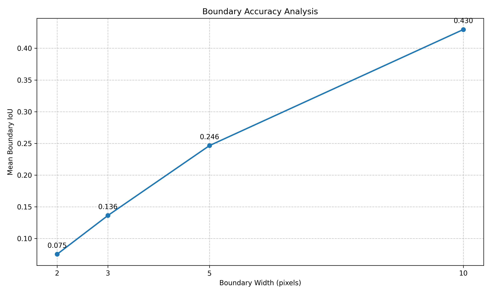
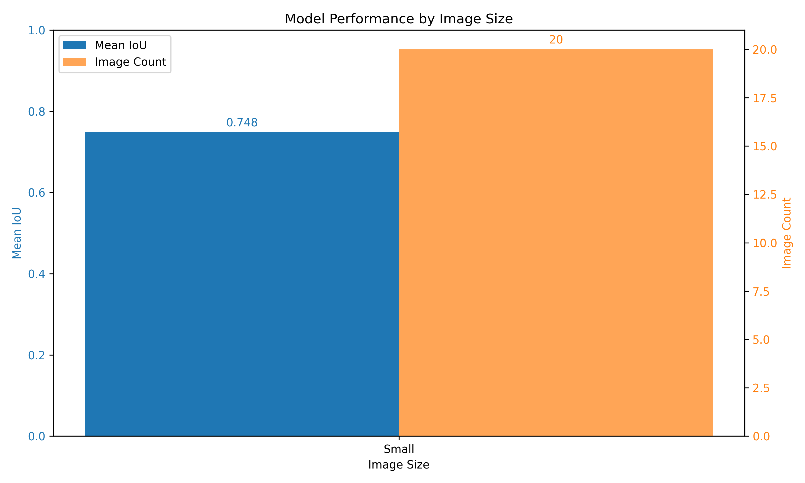

# Mask2Former-Swin-Base-Semantic Evaluation Summary

## Dataset Information
- Dataset: corrosion_test
- Number of images: 20
- Classes: Background, Fair, Poor, Severe

## Standard Metrics
- mIoU: 66.3005
- fwIoU: 87.8386

### Per-Class IoU
- Background: 93.9069
- Fair: 74.4863
- Poor: 63.9882
- Severe: 32.8206

## F1 Scores
- Background: F1=0.9686 (P=0.9608, R=0.9765)
- Fair: F1=0.8538 (P=0.8985, R=0.8133)
- Poor: F1=0.7804 (P=0.7128, R=0.8622)
- Severe: F1=0.4942 (P=0.9296, R=0.3366)
- Macro Average: F1=0.7742 (P=0.8754, R=0.7472)

## Boundary Accuracy Analysis
Analysis of segmentation performance near boundaries:

### Boundary Width: 1px
- Mean IoU: nan
- Per-class boundary IoU:
### Boundary Width: 2px
- Mean IoU: 0.0752
- Per-class boundary IoU:
  - Background: 0.0897
  - Fair: 0.0808
  - Poor: 0.0771
  - Severe: 0.0533
### Boundary Width: 3px
- Mean IoU: 0.1363
- Per-class boundary IoU:
  - Background: 0.1632
  - Fair: 0.1451
  - Poor: 0.1370
  - Severe: 0.0998
### Boundary Width: 5px
- Mean IoU: 0.2465
- Per-class boundary IoU:
  - Background: 0.2953
  - Fair: 0.2612
  - Poor: 0.2467
  - Severe: 0.1828
### Boundary Width: 10px
- Mean IoU: 0.4295
- Per-class boundary IoU:
  - Background: 0.4967
  - Fair: 0.4547
  - Poor: 0.4294
  - Severe: 0.3374

## Size Sensitivity Analysis
Analysis of performance on different image sizes:

- Small images (20): Mean IoU = 0.7483, Median IoU = 0.7883, Std = 0.1483

## Model Performance Analysis
- Model size: 407.73 MB
- Total parameters: 106,884,669
- Trainable parameters: 106,884,669
- Average inference time: 0.0342s
- Frames per second: 29.23 FPS

## Error Analysis
The 10 worst performing images have been visualized in the `visualizations/worst_cases/` directory to help identify common failure patterns.

## Training History

## Visualizations
See the `visualizations` directory for prediction examples.

## Plots
- Confusion matrix: `plots/confusion_matrix_counts.png` and `plots/confusion_matrix_normalized.png`
- F1 scores: `plots/f1_scores.png`
- Per-image IoU: `plots/per_image_iou.png`
- Training history: `plots/training_history.png`
