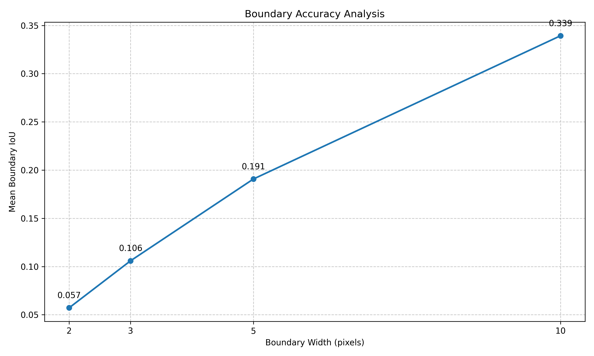
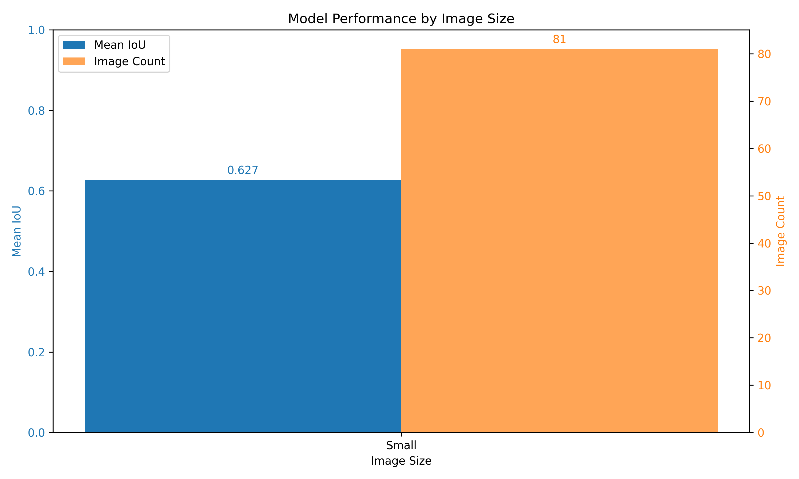

# Mask2Former-Swin-Base-Semantic Evaluation Summary

## Dataset Information
- Dataset: corrosion_val
- Number of images: 81
- Classes: Background, Fair, Poor, Severe

## Standard Metrics
- mIoU: 55.8721
- fwIoU: 83.2855

### Per-Class IoU
- Background: 92.1405
- Fair: 58.1530
- Poor: 47.9943
- Severe: 25.2007

## F1 Scores
- Background: F1=0.9591 (P=0.9598, R=0.9584)
- Fair: F1=0.7354 (P=0.7263, R=0.7448)
- Poor: F1=0.6486 (P=0.6071, R=0.6962)
- Severe: F1=0.4026 (P=0.9612, R=0.2546)
- Macro Average: F1=0.6864 (P=0.8136, R=0.6635)

## Boundary Accuracy Analysis
Analysis of segmentation performance near boundaries:

### Boundary Width: 1px
- Mean IoU: nan
- Per-class boundary IoU:
### Boundary Width: 2px
- Mean IoU: 0.0572
- Per-class boundary IoU:
  - Background: 0.0706
  - Fair: 0.0575
  - Poor: 0.0451
  - Severe: 0.0555
### Boundary Width: 3px
- Mean IoU: 0.1059
- Per-class boundary IoU:
  - Background: 0.1288
  - Fair: 0.1059
  - Poor: 0.0864
  - Severe: 0.1026
### Boundary Width: 5px
- Mean IoU: 0.1907
- Per-class boundary IoU:
  - Background: 0.2361
  - Fair: 0.1928
  - Poor: 0.1589
  - Severe: 0.1752
### Boundary Width: 10px
- Mean IoU: 0.3393
- Per-class boundary IoU:
  - Background: 0.4135
  - Fair: 0.3491
  - Poor: 0.2987
  - Severe: 0.2960

## Size Sensitivity Analysis
Analysis of performance on different image sizes:

- Small images (81): Mean IoU = 0.6273, Median IoU = 0.6365, Std = 0.1682

## Model Performance Analysis
- Model size: 407.73 MB
- Total parameters: 106,884,669
- Trainable parameters: 106,884,669
- Average inference time: 0.0378s
- Frames per second: 26.44 FPS

## Error Analysis
The 10 worst performing images have been visualized in the `visualizations/worst_cases/` directory to help identify common failure patterns.

## Training History

## Visualizations
See the `visualizations` directory for prediction examples.

## Plots
- Confusion matrix: `plots/confusion_matrix_counts.png` and `plots/confusion_matrix_normalized.png`
- F1 scores: `plots/f1_scores.png`
- Per-image IoU: `plots/per_image_iou.png`
- Training history: `plots/training_history.png`
